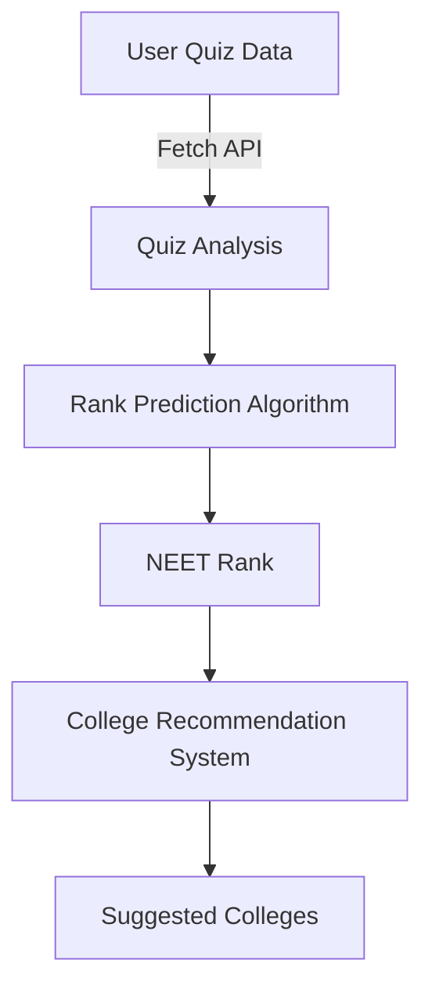

# 🎯 NEET Rank Predictor & College Recommendation System  

🚀 **Analyze NEET quiz performance, predict student rank, and recommend medical colleges based on estimated ranks.**  

---

## 📌 **Overview**  
This project helps **NEET aspirants** track their performance and **predict their potential NEET rank** based on quiz data. It also suggests **medical colleges** where the student is most likely to secure admission.  

✅ **Quiz Performance Analysis**  
✅ **AI-based Rank Prediction**  
✅ **College Recommendation System**  

---

## 🔢 **How It Works**  

### 📥 **1. Data Collection**  
- Retrieves **historical & current quiz data** via APIs.  
- Extracts **score, accuracy, speed, and question-wise response patterns**.  

### 📊 **2. Rank Prediction Algorithm**  
- Uses past quiz scores and a scoring model to **estimate NEET rank**.  
- Computes an **adjusted "better than" score** to predict ranking.  

### 🏫 **3. College Recommendation Algorithm**  
- Maps the predicted rank to a **college dataset** (Rank vs. College List).  
- Adjusts the **margin of error** to suggest nearby colleges.  

---

## 🏗 **Project Architecture**  

## 📜 Installation & Setup

1️⃣ Clone the repository
git clone https://github.com/Sukrit-Prakash/neet-analysis.git

cd neet-rank-predictor

2️⃣ Install dependencies
npm install

3️⃣ Run the server
-->go to source

cd src

node server.js  or nodemon server.js

## 📊 API Endpoints

| **Method** | **Endpoint** | **Description** |
|------------|------------|-----------------|
| `GET`  | `/api/topic-wise-performance`  | Fetch topic wise analysis like weak topics |
| `GET`  | `/api/current-performance`  | Getting recent quiz performance |
| `GET` | `/api/rank-prediction`  | Predicts NEET rank |
| `GET` | `/api/college-prediction`  | Suggests some college based on rank |

## 🤝 Contributing
We welcome contributions! Feel free to open an issue or submit a pull request.

---

## 🏆 Future Enhancements

🔹 **Algo Rank Prediction (ML Model)**  
🔹 **Personalized Study Recommendations**  
🔹 **State-wise & Category-based College Suggestions**  

